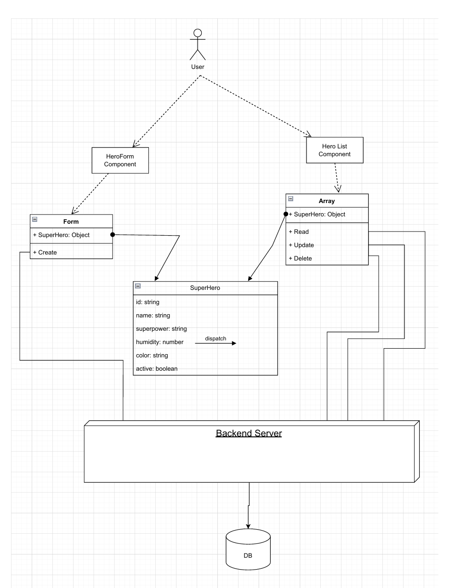

# Superhero Project

## Team Members
- Kemal Durukan Mert
- Sefa Akkaya
- Alperen Sarigol
- Alper Inan
- Ayse Begum Nas
- Bahadir Gulen
- Muhammet Halil Adiguzel

## Project Overview
The Superhero Project is a web application that allows users to view and add superheroes along with their superpowers and humility scores. The project is divided into two main parts: the backend and the frontend.

### Backend
The backend is built using Node.js and Express. It provides a RESTful API to manage superheroes. The main functionalities include:
- Retrieving all superheroes sorted by their humility scores.
- Adding a new superhero with a name, superpower, and humility score.

### Frontend
The frontend is built using React. It provides a user interface to interact with the backend API. The main functionalities include:
- Displaying a list of superheroes.
- Adding a new superhero through a form.

### Diagram
Below is a diagram illustrating the architecture of the Superhero Project:



## Getting Started

### Backend
1. Navigate to the `superhero-backend` directory.
2. Install the dependencies:
   ```sh
   npm install
3. Start the server:
    ```sh
   npm start

### Frontend
1. Navigate to the `superhero-frontend` directory.
2. Install the dependencies:
   ```sh
   npm install
3. Start the server:
    ```sh
   npm start
